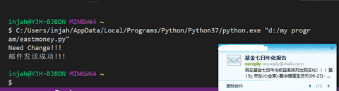
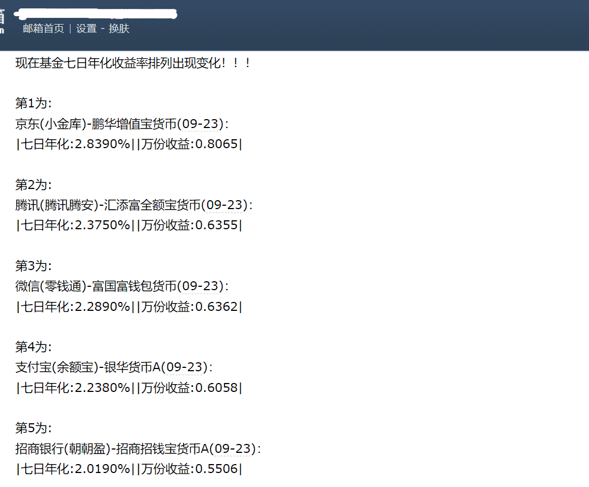

# eastmoney-get
获取基金七日年化百分比排列数据，合理选择投资方。

### 思路
- 从各个平台获取基金相关信息
- 从基金数据网站爬取实时数据
- 获取七日年化并按照大小排列
- 判断临界条件发送邮件通知我

### 基金相关信息
- 支付宝 - 余额宝 - 银华货币A
- 微 信 - 零钱通 - 富国富钱包货币
- 京 东 - 小金库 - 鹏华增值宝货币
- 可补充

### 运行演示

### 使用前
修改此处代码
~~~python
mail_is_ok('stmp的qq邮箱', 'stmp的qq邮箱密码', '收信账号s', massage)
~~~
把它放在服务器每天定时执行就可以了。
